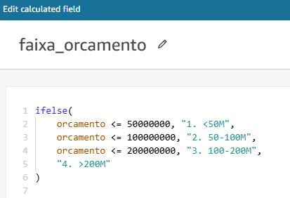

# **Sprint 10: Desafio**

## **1. Objetivos**

Este desafio teve como objetivo a conclusão da última entrega do desafio final. Essa entrega consistia na criação de um dashboard utilizando o Amazon QuickSight a partir da fonte de dados contida na camada Refined.

Clique nos seguintes links para acessar os respectivos arquivos:

- [Dashboard em .PDF](../desafio/entrega_5/heitor.ana_dashboard.pdf)
- [Dashboard em .PNG](../desafio/entrega_5/heitor.ana_dashboard.png)
- [Diagrama do modelo dimensional final](../desafio/entrega_5/modelo_dimensional_final.png)

## **2. Introdução**

Com base em uma experiência prévia no audiovisual e no cinema brasileiro, tive a oportunidade de participar de diversos projetos de baixo a médio orçamento obtendo resultados positivos por parte da crítica. Em um mercado cinematográfico bilionário movido por grandes investimentos e produções de alta escala, muitas vezes, diversos filmes fora deste eixo lidam com restrições financeiras e dificuldades de produção. A partir disso surge um questionamento central que pode vir a ser de interesse tanto de investidores quanto cineastas: produções com orçamentos elevados garantem a qualidade de um filme?

A análise realizada buscou explorar essa questão com um recorte para os filmes de ação, gênero que é conhecido por possuir os maiores orçamentos do mercado cinematográfico, além de efeitos visuais de última tecnologia e grande apelo comercial. Essas produções possuem investimento robusto em produção e divulgação, além de contar com atores extremamente famosos. O objetivo desse tipo de produto é claro: atrair o maior número possível de público e potencializar os lucros, gerando uma grande receita. 

Dessa forma, produções independentes ou com baixo orçamento enfrentam muitos desafios. Apenas fatores como popularidade, orçamento e receita garantem uma boa avaliação? A quantidade exorbitante de dinheiro investido em mega produções é um fator definitivo para isso? Como os filmes de baixo orçamento podem competir com esses gigantes?

## **3. Modelo de dados**

Nesta nova etapa do desafio foi necessário realizar uma nova modelagem de dados. Infelizmente, com o modelo da sprint anterior, ao levar os dados para o QuickSight, foram encontrados alguns erros que impediam a leitura do dataset. A tabela fato anterior não continham dados importantes e alguns tipos estavam errados. 

Para resolver este problema foi realizado um novo job no Glue. Você pode acessá-lo [clicando aqui](../desafio/entrega_5/job_camada_refined_v2.py). Abaixo é possível observar a definição da nova tabela fato:

- Aqui é possível ver as definições dos tipos de dados com a utilização do `cast`, além da inserção de novas colunas na tabela fato.

O novo modelo dimensional foi elaborado no mesmo formato anterior, _star schema_. Dessa vez, os dados quantitativos e as métricas estão localizadas na tabela fato, permitindo o cruzamento com as demais dimensões, além de serem o principal núcleo desta análise.

Era exatamente este problema que foi resolvido. Anteriormente, esses dados não estavam na tabela fato e estavam definidos com o tipo de dado errado, impossibilitando os joins entre as tabelas. Na imagem a seguir podemos ver os joins realizados com sucesso no QuickSight.

Em seguida, foram criados alguns campos para gerar novos insights, são eles: `faixa_orcamento` e `decadas`. Eles foram determinados da seguinte forma:

Assim, para o campo `faixa_orcamento` foi possível fazer o agrupamento do orçamento a partir das faixas estabelecidas, possibilitando um insight importante que veremos adiante. Para o campo `decadas` foi possível agrupar os anos em decadas, otimizando a visualização dos gráficos. 

## **4. Dashboard**

Este dashboard apresenta uma análise detalhada da relação entre orçamento, popularidade e a qualidade de filmes populares de ação. A partir dos dados organizados e das visualizações obtidas, podemos entender como essas variáveis estão interligadas e assim responder as nossas perguntas. Abaixo é possível visualizar o dashboard completo:

Na sequência, examinaremos cada detalhe deste dashboard.

### **4.1. KPIs**

Para começar, estão destacados alguns indicadores chaves (KPIs). Com eles, é possível obter um resumo, facilitando a compreensão das métricas mais importantes. 

- O filme _Venom: A Última Rodada_ possui a popularidade mais alta, isso mostra como certos filmes ressoam com o público, mesmo sem depender de avaliações de qualidade. O filme que possui o mair orçamento é o _Avatar: O caminho da água_, um filme de alta popularidade e de grande escala.

- O filme com maior avaliação é o _Batman: O cavaleiro das trevas_. Já a pior avaliação fica com o filme _Território Virgem_.

### **4.2. Gráfico de Evolução da média do Orçamento e da Receita ao longo do tempo**

Para começar a nossa análise, é importante entender como alguns dados se comportam ao longo do tempo. Assim, é fundamental compreendermos como o investimento financeiro em produções de filmes e o retorno financeiro mudaram ao longo das décadas. 

- Neste gráfico, podemos entender a escalada dos orçamentos nos filmes de ação, especialmente a partir dos anos 2000. Com uma breve pesquisa podemos entender que com o surgimento de novas tecnologias, como o CGI, possibilitou maiores investimentos em produções de grande porte. 

- É importante salientar que o aumento nos orçamentos está associado a uma maior receita média, mas nem sempre porporcionalmente. Dessa forma, é possível concluir que existem grandes desafios na lucratividade de certas produções.

- A partir dos anos 2020 há uma queda tanto nos investimentos quanto no lucro obtido. Provavelmente isso é decorrente da pandemia do Covid-19. Isso nos mostra como o mercado cinematográfico foi atingido por fatores externos e globais. 

### **4.3. Gráfico de Evolução da Popularidade ao longo do tempo**

Outro dado fundamental para a nossa análise é a compreensão da evolução da popularidade dos filmes ao longo do tempo. Mas como é calculada essa popularidade?

Segundo o próprio site do TMDB, a popularidade é uma métrica bastante importante e é impactada por diversos fatores e tipos de votos, como: número de votos do dia, número de visualizações do dia, número de usuários que marcaram como "favorito", número total de votos, entre outros. 

- A partir desse gráfico, podemos entender que existem picos significativos de popularidade de acordo com a década. Na década de 1970, houve um grande crescimento das franquias de ação, sem contar com o advento do marketing global com o passar do tempo.

- Podemos destacar o impacto de grandes lançamentos após os anos 2000, em que houve uma granda escalada, reforçando os grandes investimentos feitos nessa época, além do surgimento de novas tecnologias, como CGI e a cinematografia digital, gerando novos cargos, equipamentos e possibilitando novas técnicas, como a colorimetria digitalizada, possibilitando uma nova onda de filmes e franquias de grande sucesso. 

### **4.4. Gráfico de Barras: Média das Avaliações pelo Orçamento**

Chegando ao cerne da análise, veremos como o impacto dos orçamentos se desdobram na qualidade dos filmes. Aqui a qualidade será medida a partir das avaliações dos filmes. O gráfico abaixo compara a média de avaliação dos filmes com diferentes faixas de orçamento.

- Embora não exista uma diferença exuberante entre as avaliações, o gráfico nos mostra que filmes de baixo e médio orçamento tendem a ter melhores avaliações do que os de orçamento muito alto, acima de $200M. Aqui chegamos a um dos pontos da nossa análise e nos faz questionar o conceito de que mais investimento garante qualidade. Isso é importante para evitar futuros riscos e gastos desnecessários.

### **4.5. Gráfico de Barras e Linha: Média da Popularidade pelo Orçamento**

Dando continuidade ao impacto do orçamento, relacionaremos a popularidade dos filmes com as mesmas faixas de orçamento.

- Na maioria dos casos, os filmes com maior orçamento possuem boa parte do dinheiro destinado à peças publicitárias e produtos de divulgação. Dessa forma, diferente das avaliações, a popularidade é mais alta para filmes de orçamento médio-alto, $100-200M, indicando que um maior investimento nem sempre se traduz em qualidade, mas com certeza pode atrair mais público. 

### **4.6. Gráfico de Dispersão: Correlação Entre Orçamento e Avaliação**

No cinema existe a percepção comum que trouxemos aqui, de que altos orçamentos resultam em filmes de maior qualidade. É com este gráfico de dispersão que testaremos essa hipótese, explorando a relação entre o orçamento de um filme e a sua avaliação média.

- Com este gráfico podemos evidenciar que não há uma correlação clara entre orçamento alto e boa avaliação. Grande parte dos filmes que possuem uma boa qualidade também são aqueles que possuem baixo a médio orçamentos.

- As produções de baixo custo que entregam avaliações altas podem ser um exemplo de criatividade no uso de recursos. Geralmente, esses filmes buscam formas de se destacar sem o artifício do dinheiro, dando mais atenção para o enredo, roteiro e questões criativas e artísticas do filme.

- Com isso, é possível validar que produções de baixo custo, como filmes independentes, podem competir em qualidade com produções de grande escala, enquanto filmes de alto custo nem sempre são bem recebidos.

### **4.7. Tabela: Lista de Filmes Mais Bem Avaliados**

Para finalizar, é importante trazer um detalhamento granular dos filmes de ação mais bem avaliados e as suas respectivas métricas (avaliações, orçamento, receita, popularidade e votos). Possibilitando uma visão ampla da questão abordada até então.

- Com essa tabela, podemos refletir sobre as preferências do público, destacando produções de qualidade reconhecida.

- Majoritariamente, existe uma dominância dos filmes de ação do Estados Unidos, causando um grande impacto global. Entretanto, é possível encontrar produções que fogem desta regra.

- Filmes com alta popularidade nem sempre são os mais bem avaliados, sugerindo diferenças entre público e crítica.

- Muitos dos filmes listados pertencem a grandes franquias, como _Batman_ e _O Senhor dos Anéis_, o que indica a força de marcas estabelecidas nesse mercado. Sem contar que esses filmes revolucionaram o cinema utilizando tecnologias inéditas: efeitos visuais, computação gráfica, efeitos práticos etc. No entanto, filmes independentes, como _A Origem_, e filmes com baixo custo e fora do circuito hollywoodiano, como os filmes _O Profissional_, _Oldboy_ e _Evangelion_ também aparecem, mostrando que a originalidade e a inovação ainda são valorizadas.

## **5. Conclusão**

Esta análise revelou insights significativos sobre a relação entre orçamento, popularidade e qualidade dos filmes de ação. A partir dos dados apresentados no dashboard, foi possível observar como os investimentos no mercado cinematográfico evoluíram ao longo das décadas, especialmente a partir dos anos 2000, com o avanço das tecnologias e o aumento do apelo comercial das produções de grande escala.

Embora os altos orçamentos tenham contribuído para maior popularidade e receitas, eles nem sempre se traduziram em qualidade superior, esta medida por avaliações dos filmes. Produções de baixo e médio orçamento mostraram-se competitivas em termos de qualidade, destacando o impacto da criatividade e do uso eficiente de recursos cinematográficos. Isso mostra que grandes investimentos não garantem necessariamente uma melhor recepção crítica.

Além disso, filmes de ação com alto apelo global e pertencentes a grandes franquias continuam dominando o mercado, enquanto produções independentes e inovadoras demonstraram que é possível competir com criatividade e originalidade. 