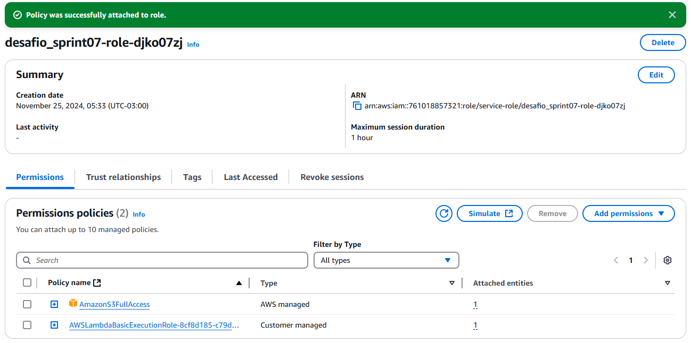
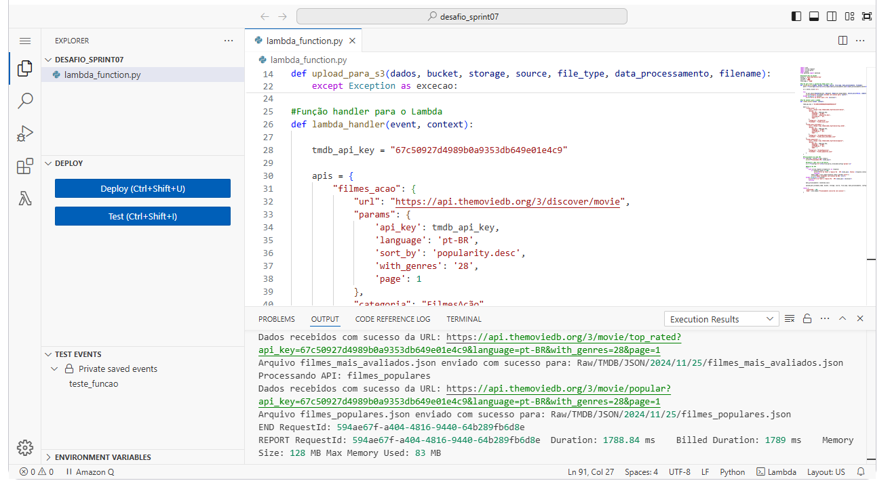
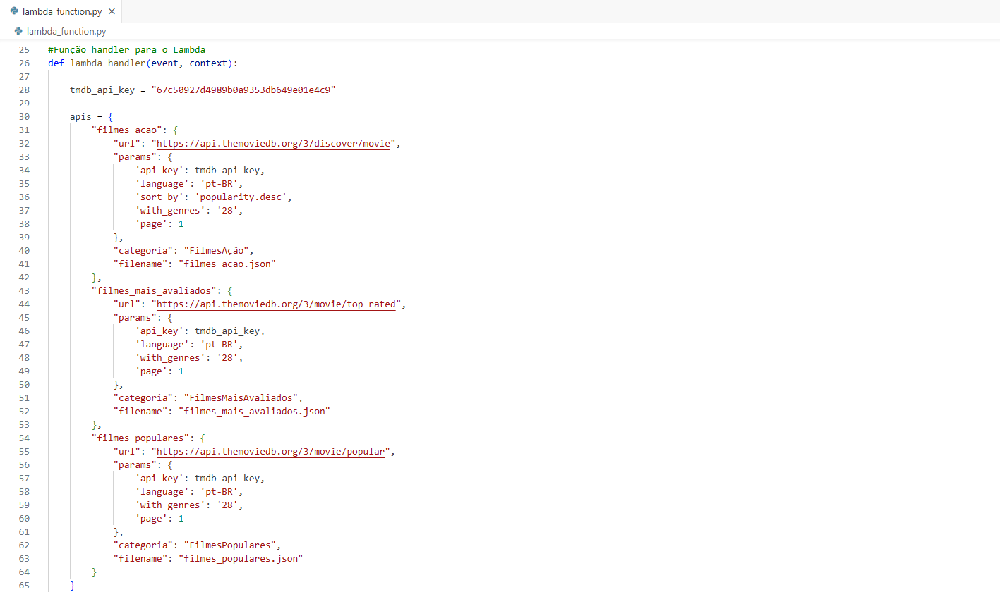
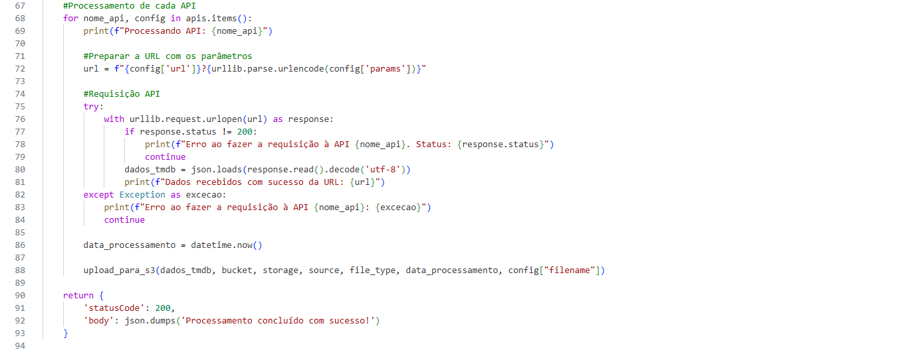

# **Sprint 7: Desafio**

## **1. Objetivos**

Este desafio teve como objetivo a obtenção dos dados do TMDB via AWS Lambda, realizando chamadas da API. Esses dados coletados foram upados dentro do S3, no mesmo bucket da etapa anterior. Nesse caso, os arquivos eram JSON. 

Dessa forma, nessa etapa deveríamos complementar os dados dos Filmes e Series carregados anteriormente.

Clique nos seguintes links para acessar os respectivos códigos e arquivos:

- [Script Python - Função Lambda](../desafio/entrega_2/lambda_function.py)
- [Arquivos JSON](../desafio/entrega_2/dados_tmdb)

## **2. Definição de Tema - Perguntas a serem respondidas**

Agora com acesso às APIs foi possível visualizar certos dados que não tínhamos acesso anteriomente. O meu desafio abordará a **Análise da Relação entre Orçamento e Qualidade em Filmes de Ação da década de 2000 a 2010**. Dessa forma, as perguntas motivadoras a serem respondidas na minha pesquisa são:

- O orçamento de produção está diretamente relacionado às notas de avaliação dos filmes de ação?

- Filmes de baixo orçamento podem alcançar qualidade semelhante a filmes de alto orçamento?

Tendo em vista que a década de 2000 a 2010 foi um perído de transição no cinema, muito marcado pela popularização do uso de tecnologias como CGI e das expansões de certas franquias, podemos nos atentar a algumas questões, como:

- Filmes com orçamento elevado tiveram maior sucesso comercial entre 2000 e 2010?

- Existe uma correlação entre o orçamento de um filme de ação e sua nota média durante o período?

- O surgimento de tecnologias, como CIG, na década de 2000 impactou a relação entre orçamento e qualidade dos filmes de ação?

- Como os filmes de ação da década de 2000 a 2010 se diferem em termos de orçamento e qualidade em comparação a décadas anteriores ou posteriores?

## **3. Desenvolvimento**

### **3.1. Passo a passo**

Para começar o desafio, o primeiro passo foi a criação da função no Lambda, como podemos ver na imagem a seguir:

Com as perguntas definidas, foi possível priorizar quais APIs do TMDB seriam importantes para a ingestão de dados. Nessa sprint utilizei 3 urls, sendo elas:

- `https://api.themoviedb.org/3/discover/movie`
- `https://api.themoviedb.org/3/movie/top_rated`
- `https://api.themoviedb.org/3/movie/popular`

Ainda faltam algumas URLS a serem utilizadas, principalmente para extrair alguns dados de orçamento. Infelizmente, não tive tempo de separar esses dados durante essa sprint. De qualquer forma, a base de dados acredito que esteja bem completa. 

- Acima, imagem do código realizado.

Para dar continuidade no desafio, foi necessário resolver algumas questões de permissão, como podemos ver na imagem abaixo:

- Permissão de acesso total ao S3 sendo concedida ao Lambda

Nas imagens a seguir, temos a evidencia do código em execução, subindo os arquivos no caminho solicitado:

- Resultado do código executado: criação da pasta TMDB.

- Resultado do código executado: arquivos JSON gerados dentro do path solicitado.

### **3.2. O código**

Nessa seção iremos destrichar a função e explicar o código em si. Acesse o scripit no link abaixo:

[Script Python - Função Lambda](../desafio/entrega_2/lambda_function.py)

Primeiramente, foi necessário fazer a importação de bibliotecas como `json`, `boto3`, `datetime`, `urllib.request` e `urllib.parse`. Infelizmente o Lambda não trabalha com a biblioteca `requests`, então a utilização da URLLIB se deu por isso. Claro que era possível criar uma layer e assim subir a biblioteca no Lambda, mas depois de um tempo de pesquisa preferi procurar uma outra forma de fazer esses requests por pura curiosidade.

Como é possível ver na imagem, eu acabei aproveitando muito do corpo do código da última sprint, a estrutura era bem similar. Então na parte de configuração do bucket foi adicionado apenas a variável `file_type`, pensando no path final. 

A função `upload_para_s3` também é bem similar a anterior. Ela é a função responsável por envolver o processo de envio dos dados processados para o bucket do S3. Aqui é importante ressaltar a montagem do caminho `path` baseado no parâmetro solicitado, incluindo a data. O envio para o S3 converte os dados JSON em string antes do envio. Nessa função, continuei utilizando o tratamento de erros, para exibir mensagens caso houvesse falhas (as quais me deparei algumas vezes).

### **3.3. Função Lambda**

Na imagem abaixo, podemos ver a função:

A função `lambda_handler` é o ponto de entrada da função Lambda. Basicamente, ela é dividida em 4 partes:

- **1. Configuração da API TMDB:** Aqui é utilizada a chave de autenticação para acessar as APIs do TMDB. Cada API contém uma URL base, o seus parâmetros e filtros. Elas foram definidas 3 APIs para serem processadas:
    - filmes_acao: Filmes de ação mais populares.
    - filmes_mais_avaliados: Filmes mais bem avaliados de ação.
    - filmes_populares: Filmes populares de ação.

- **2. Processamento das APIs:** Nessa parte é onde ocorre a iteração em cada API, utilizando os parâmetros da `urllib.parse.urlencode` e fazendo a requisição usando `urllib.request.urlopen`. Dessa forma, o código lê e decodifica os dados retornados no formato JSON.

- **3. Envio ao S3:** Após obter os dados de cada API, invoca a função `upload_para_s3` para enviar os dados processados ao bucket S3.

- **4. Retorno final:** Após processar todas as APIs, retorna uma mensagem indicando o sucesso.

### **3.4 Considerações finais do código**

Por fim, este código automatizava a coleta de dados de diferentes APIs do TMDB e organizou essas informações no S3. Ele realizou requisições para obter dados sobre filmes, formatando os resultados em JSON, armazenando em pastas baseada na data do processamento. O uso do AWS Lambda, por mais complicado que tenha sido, principalmente na questão da definição da função `lambda_handler`, garantiu a automatização e tornou o processo eficiente.