# **Sprint 8: Desafio**

## **1. Objetivos**

Este desafio teve como objetivo a utilização do Apache Spark, através do AWS Glue, para integrar os dados existentes na camada Raw para a Trustedzone, gerando uma visão padronizada dos dados encontrados no S3, sendo acessível pelo AWS Athena. 

Dessa forma, os dados contidos no bucket do S3, tanto o `.csv` quanto o `.json` serão transformados em `PARQUET` e particionados por data de criação no momento da ingestão dos dados.

Clique nos seguintes links para acessar os respectivos códigos e arquivos:

- [Job CSV](../desafio/entrega_3/job_desafio_csv.py)
- [Job JSON](../desafio/entrega_3/job_desafio_json.py)
- [Arquivos JSON](../desafio/entrega_3/jsons/)

## **2. Motivadores**

Antes de começar o desafio da Sprint, foi necessário voltar um pouco atrás para fazer a ingestão de mais dados. Após analise, ficou claro que os dados estavam escassos. Nesse caso, para o desenvolvimento da minha análise, era necessário alguns dados referentes ao orçamento dos filmes e uma maior quantidade de filmes. Então, foram utilizados as seguintes APIs:

- **Popular:** Este endpoint representa os filmes que estão em alta no momento, com maior engajamento. Geralmente esses filmes possuem altos orçamentos. Dessa forma, é útil para avaliar se um alto orçamento está associado com a popularidade do filme e com a qualidade, ou seja, a nota média. Com isso, é possível responder algumas perguntas como: Filmes populares geralmente têm altos orçamentos? Existe uma relação entre qualidade (notas) e popularidade?
- **Top rated:** Este endpoint reúne os filmes mais bem avaliados com base na média das notas dos usuários. É possível responder perguntas como: Filmes com alta qualidade precisam de um orçamento alto? Qual a média de orçamento dos filmes mais bem avaliados?
- **Now playing:** Este endpoint reúne os filmes que estão atualmente em exibição, captando os lançamentos mais recentes. Mesmo não fazendo parte do meu escopo inicial, esse endpoint foi utilizado como "coringa" para possível uso em determinadas circunstâncias. 

## **3. Função Lambda**

Pensando exatamente na minha análise, elaborei um código para coletar mais dados via TMDB. Para isso, foi criada uma layer com a biblioteca `requests`:

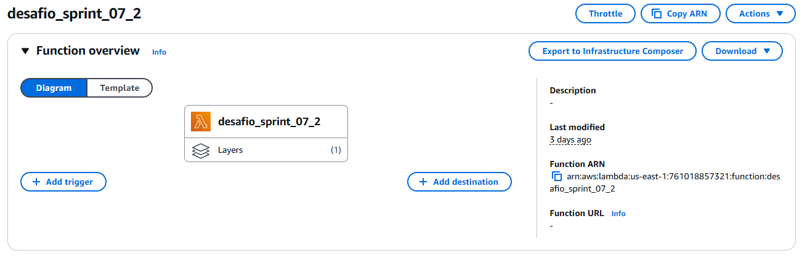

A ideia desse código era coletar os todos os dados de uma vez a partir de 3 APIs. Você pode visualizar o código **[clicando aqui](../desafio/entrega_3/lambda_function.py)**.

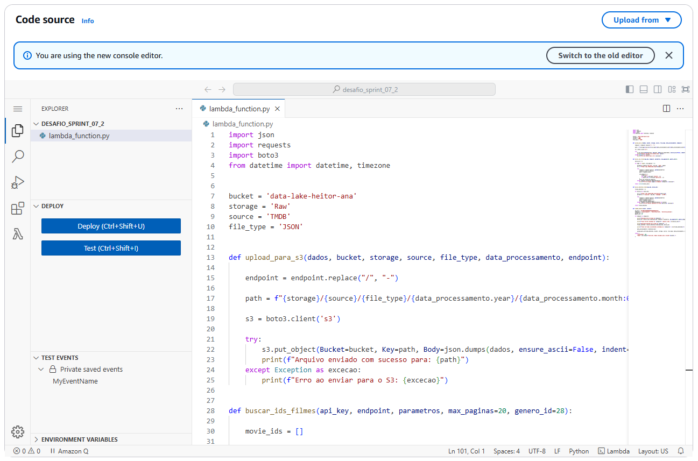

Essa sprint não tinha o foco no lambda, então não vou me ater muito aos detalhes do código em si. Mas é importante ressaltar algumas coisas:

- Definição de duas funções: `buscar_ids_filmes` e `buscar_detalhes_filmes`. Os nomes são auto explicativos. A primeira tem como objetivo coletar os IDs dos filmes pertencentes ao genero de ação a partir da iteração das páginas, além de filtrar os filmes pelo ID 28 (ação). Já a segunda função tem como objetivo buscar as informações detalhadas de cada filme, para cada filme encontrado anteriormente, ela realiza uma chamada para a API, adicionando os detalhes de cada filme e armazenando os resultados. Dessa forma foi possível conseguir detalhes como o orçamento, avaliações e muito mais. 
- A função `lambda_handler` é a função principal do código. É nela que foram definidos os endpoints da API e a coleta e processamento dos dados a partir da chamada às funções anteriores. Por fim, faz upload no S3 para enviar os dados ao bucket de forma particionada. 

Na imagem abaixo, podemos ver o resultado do código que gerou os arquivos `.json` de forma particionada como solicitado. 

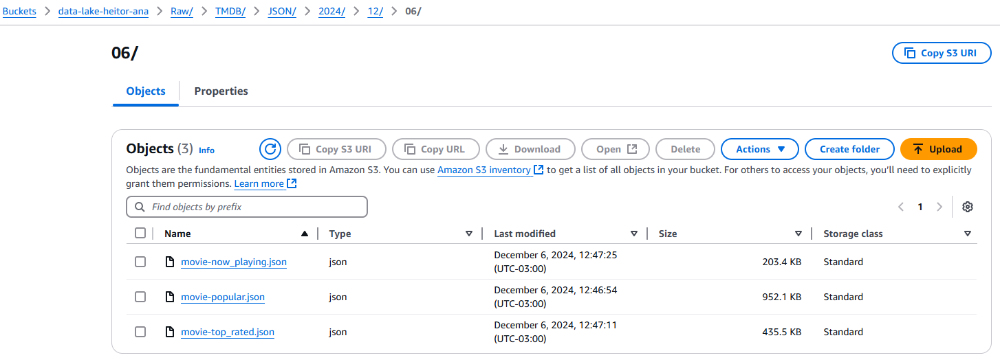

## **4. Jobs no Glue**

O primeiro passo realizado foi a criação de um database: 

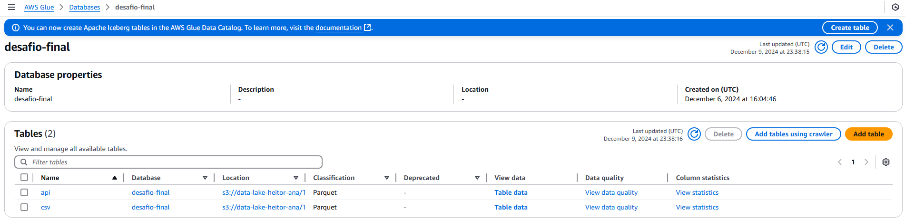

### **4.1. Job CSV**

Para fazer a integração de dados da camada Raw para a camada Trusted, foi realizado dois códigos distintos, um para o arquivo CSV e outro para os arquivos em JSON. Abaixo, é possível ver o código do Job para o arquivo CSV.

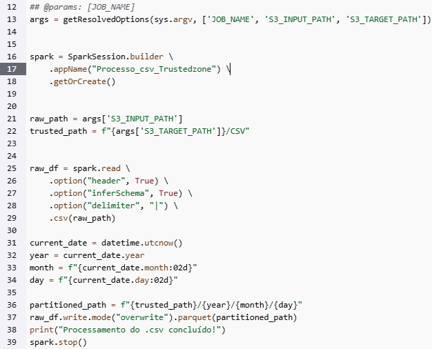

O script processa os arquivos CSV da camada Raw, transforma os dados em Parquet e os organiza na camada Trusted do Data Lake. Para isso, primeiramente, foram definidos os parâmetros de entrada:

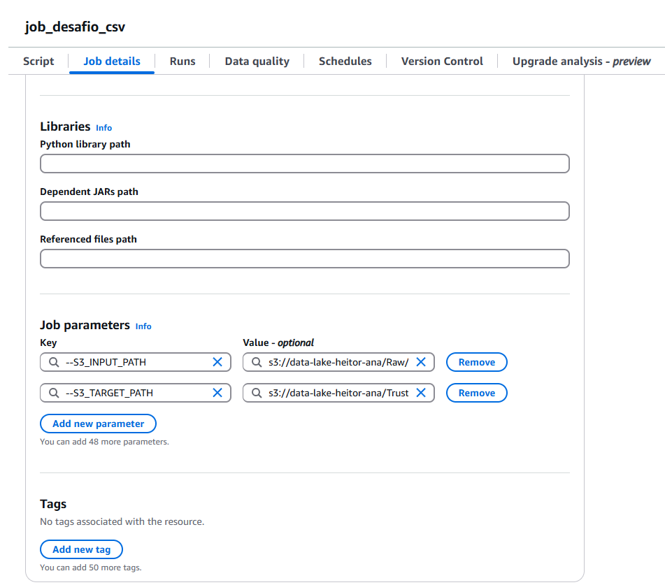

Após algumas tentativas sem sucesso, para a leitura dos dados, foi utilizado o `delimiter="|"`, pois é nessa estrutura que o arquivo CSV se encontrava. Isso foi percebido pois algumas tentativas foram bem sucedidas, mas infelizmente, ao realizar as consultas no Athena, os dados estavam todos bagunçados. Abaixo, podemos ver algumas das tentativas realizadas.

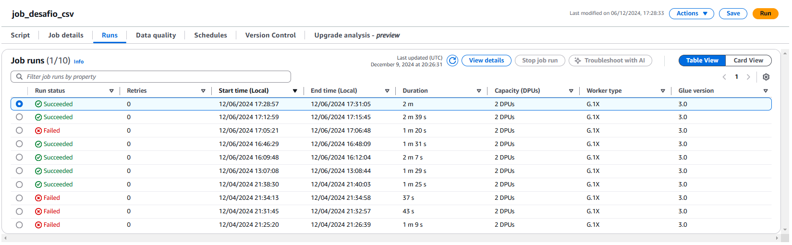

Na próxima imagem, podemos ver o resultado do script, a conversão para Parquet foi bem sucedida. 

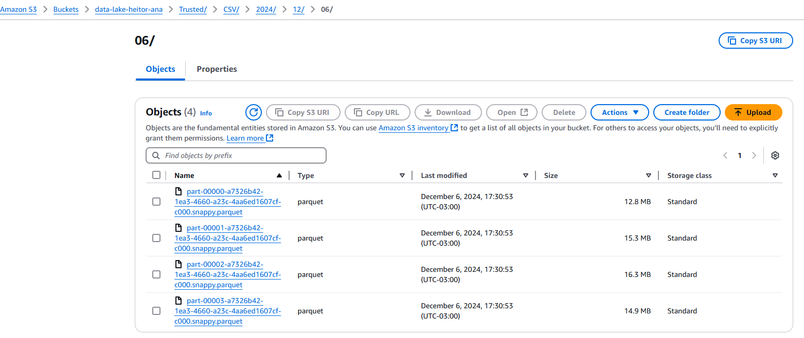

Nesse script eu não me preocupei em retirar colunas que não seriam utilizadas, o objetivo foi apenas particionar e fazer a conversão para Parquet, mantendo todos os dados obtidos.

### **4.2. Job JSON**

Agora, para fazer a integração dos dados obtidos da coleta da API, o passo a passo foi basicamente o mesmo.

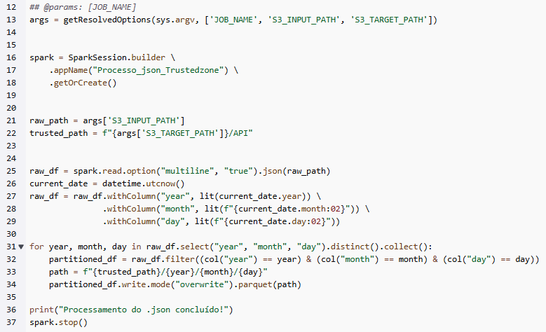

Este script é bem similar ao script do CSV, mas com algumas diferenças:

-  Utilização de funções auxiliares, como `lit` para criar colunas com valores constantes, `col` para facilitar a manipulação de colunas do DataFrame, `input_file_name` que permite acessar o nome do arquivo de entrada e `datetime` para obter a data atual e adicionar metadados ao DataFrame. 
- Leitura dos arquivos JSON no caminho especificado utilizando `option("multiline", "true")`, pois os arquivos JSON possuem múltiplas linhas por registro.
- Particionamento por data, com filtragem para os nomes ficarem da maneira correta.

A seguir, podemos ver as tentativas de execução do job e o particionamento no S3.

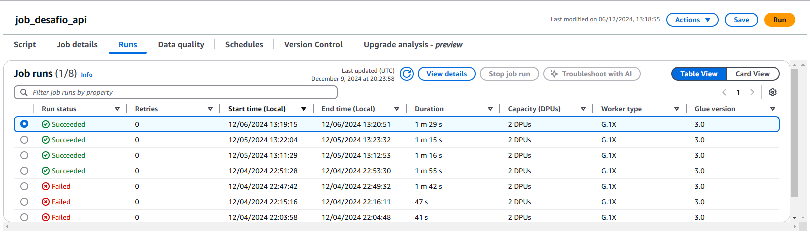

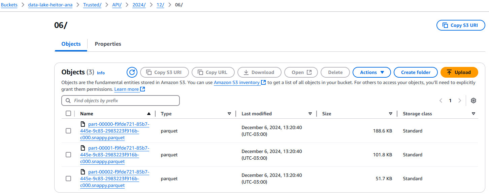

Dessa forma, realizado os Jobs, o bucket no S3 ficou assim:

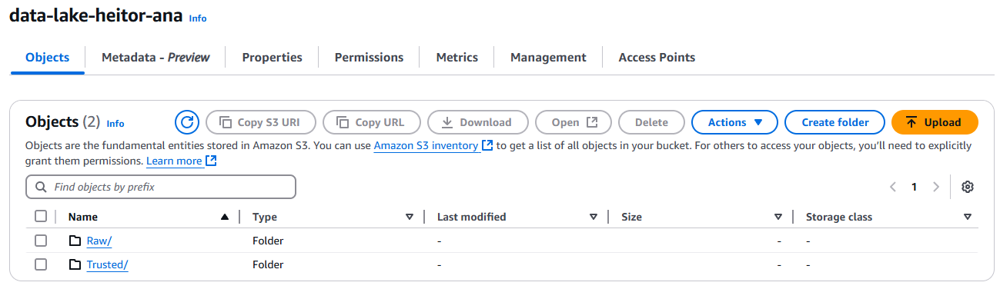

### **5. Crawlers**

Os crawlers são ferramentas automatizadas com o objetivo de explorar os dados armazenados. No nosso caso, esses dados estão no S3. Ele é capaz de realizar automaticamente a estrutura (esquema) desses dados e criar tabelas no Glue Data Catalog.

Neste desafio, optei pela criação de dois crawlers, um para os dados extraídos do CSV e outro para os dados extraídos dos arquivos JSON.

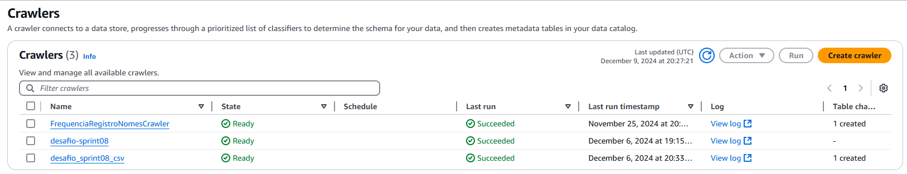

A criação desses crawlers são bem simples, basicamente bastou informar corretamente o caminho do S3 e executar. Podemos ver o resultado no Athena:

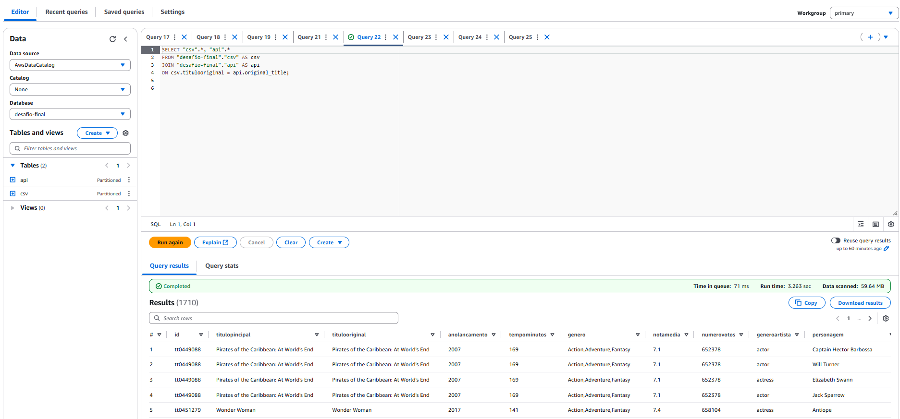

Na query acima, foi realizado uma consulta com join entre as tabelas para verificar se estava tudo correto. E essa foi a última estapa deste desafio.
