# **Sprint 9: Desafio**

## **1. Objetivos**

Este desafio teve como objetivo a modelagem de dados e processamento da camada Refined. Para isso, houve a manipulação do Apache Spark, utilizando um job através do AWS Glue para integrar os dados existentes na camada Trusted Zone com destino em uma camada intermediária, a camada Staging. A partir desses dados, foi definida a modelagem dimensional e um novo processamento para a criação da camada Refined.  

Clique nos seguintes links para acessar os respectivos códigos e arquivos:

- [Código do Job da camada Staging](../desafio/entrega_4/job_camada_staging.py)
- [Código do Job da camada Refined](../desafio/entrega_4/job_camada_refined.py)
- [Diagrama da modelagem dimensional](../desafio/entrega_4/modelo_dimensional.png)

## **2. Camada Staging**

A camada _Staging_ é uma camada intermediária onde os dados pré-processados são armazenados de forma temporária. Ela foi de extrema importância, pois serviu como um buffer para preparar esses dados antes de realizar o dimensionamento, etapa que ocorre transformações mais elaboradas e definitivas. 

Com isso, o primeiro passo desse desafio foi realizar a união dos dados gerados na sprint anterior. Para isso, foi processado um Job no AWS Glue. Foram definidos três caminhos:

- `TRUSTED_PATH_API`: caminho de origem dos dados processados da API contidos na camada Trusted.
- `TRUSTED_PATH_CSV`: caminho de origem dos dados processados do CSV contidos na camada Trusted.
- `STAGING_PATH`: caminho de destino do resultado do processamento do job atual. 

Na imagem abaixo podemos ver parte do código: 

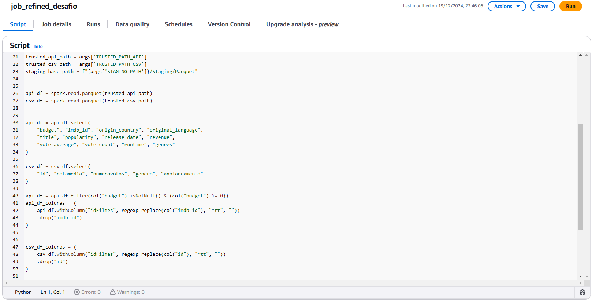

- Nas linhas 30 e 36 foi realizada a seleção das colunas necessárias para o processamento dos dados de acordo com o tipo da linha da análise escolhida, tanto da API quanto do CSV. E é exatamente por isso que mais colunas da DataFrame da API foram selecionadas.
- Na linha 40 foi realizada a filtragem de valores nulos da coluna "budget", pois é com base nesses dados que minha análise será fundamentada. 
- Nas linhas 41 e 47 foi criada uma coluna `idFilmes` em ambos DataFrames, pois eles possuíam uma mesma coluna de ids com nome diferente, dessa forma foi possível fazer a união desses dados. Com isso, foi realizado a remoção do prefixo "tt" dos dados dessas colunas com `regexp_replace`, além da remoção das colunas originais. 
- Uma observação para o nome do job. Ele não foi escolhido da melhor forma pois nas tentativas anteriores eu acreditava ser possível fazer todo o desafio em apenas um job, ou seja, todo o processamento de uma vez só. Encontrei alguns problemas no caminho e após achar a solução, mantive esse job com o código corrigido e não me atentei ao nome. 

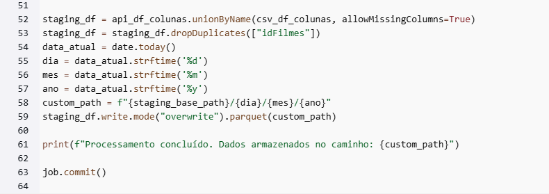

- Na linha 52 foi realizada a união dos DataFrames. Com `allowMissingColumns=True` foi possível permitir que caso alguma coluna estivesse faltando em um dos DataFrames, ela seria automaticamente preenchida com valores nulos.
- Na linha 53 foram removidas as duplicatas com base na coluna `idFilmes`, pois a análise final tem como objetivo prioritário trabalhar os dados dos filmes referentes a voto, popularidade e orçamento. 
- Na linha 54 foi gerado o particionamento da gravação desses dados. Diferentemente dos códigos anteriores, optei por utilizar o módulo `datetime` contido no python. Nos jobs anteriores eu estava enfrentando muitos problemas de particionamento com a data, principalmente na questão da nomeação dos diretórios e subdiretórios, dessa forma optei por utilizar algo que eu já tinha mais familiaridade e que deixasse o código mais simples. 

### **2.1. Resultado do processamento**

Após o processamento do job, a camada Staging ficou da seguinte forma no datalake:

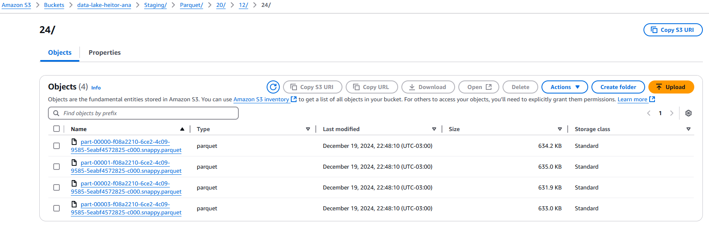

Dessa forma, foi desenvolvido um crawler para a criação da tabela unificada. 

## **3. Camada Refined**

A camada Refined é uma área em que os dados passam por transformações, estão organizados, estruturados e limpos, pronta para a análise. 

O segundo passo desse desafio foi a criação da camada Refined e, assim, a estruturação dos dados em uma modelagem dimensional. Para isso, foi elaborado previamente um diagrama contendo o Modelo de Dados, como podemos visualizar a seguir:

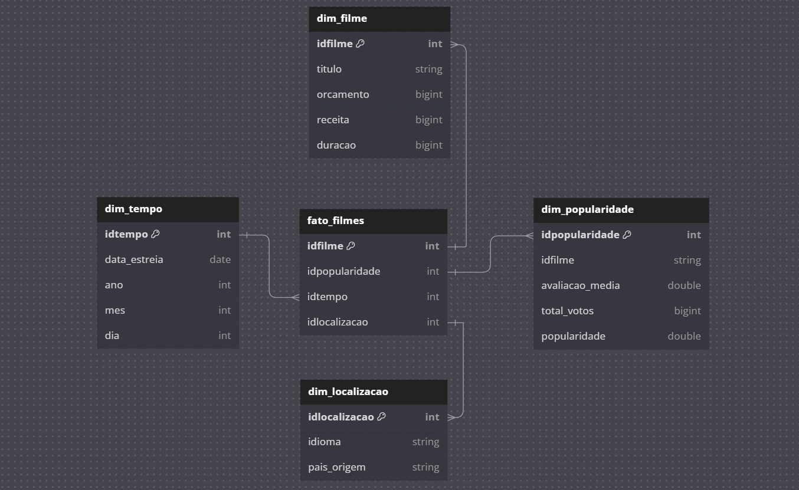

Este modelo foi estruturado de acordo com o padrão _star schema_. Contém uma tabela fato em que os dados quantitativos estão armazenados, ou seja, os ids. Por conta da análise focar em métricas quantitativas, como orçamento, notas de avaliação, retorno financeiro e popularidade, foram definidas 4 tabelas dimensão: Tempo, Localização, Filme e Popularidade. 

### **3.1. Código desenvolvido**

Agora com o modelo dimensional definido, iniciou-se o desenvolvimento do segundo job. Na imagem abaixo podemos ver a primeira parte do código:

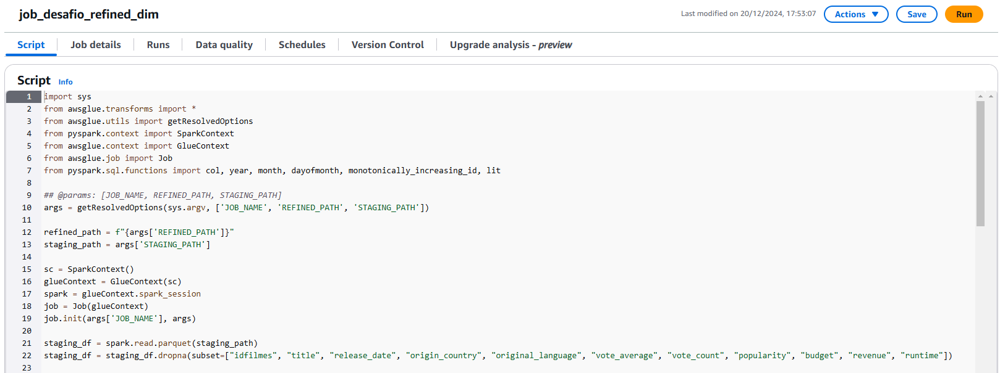

- Nas linhas 12 e 13 podemos ver a definição dos caminhos: `REFINED_PATH` e `STAGING_PATH`.
- Nas linhas 21 e 22 foi realizada o a leitura dos dados da camada Staging e, na sequência, a remoção de valores nulos nas colunas com mais importância. 

Sobre os imports, farei um adendo importante: muitos desses imports não foram utilizados no código por descuido com as mudanças durante o desenvolvimento. Nessa etapa eu obtive uma certa dificuldade na criação das tabelas, com a limpeza de dados e com o particionamento. Então após diversas tentativas frustradas, acabei deixando todos os imports dos códigos antigos. Abaixo é possível visualizar as tentativas de runs do job. 

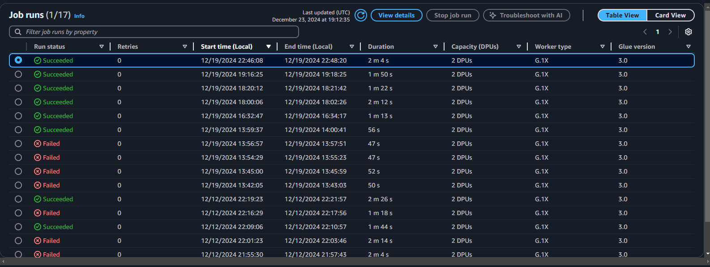

- Mesmo aqueles que obtiveram sucesso, no fim, não estavam de acordo com o que era necessário para a análise.

Voltando para o código, abaixo podemos ver a segunda parte dele:

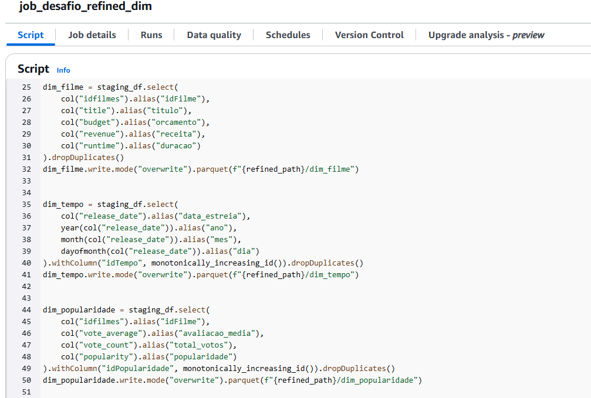

- Nesta etapa foi realizada a criação das tabelas dimensionais. 
- Para a renomeação das colunas, foi utilizado o método `.alias()`. 
- O particionamento foi realizado de acordo com a tabela.
- O `.dropDuplicates()` foi utilizado para remoção de duplicatas.

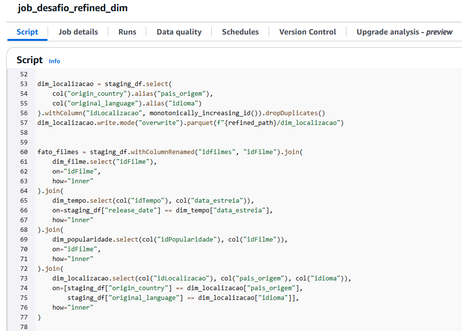

- Na criação da tabela `dim_localizacao`, `dim_tempo` e `dim_popularidade` foi utilizado o `monotonically_increasing_id` para gerar IDs únicos para cada registro, dessa forma, garantindo compatibilidade e integridade entre as tabelas. 
- A partir da linha 60 foi realizada a criação da tabela fato. Ela foi construída a partir de joins entre o DataFrame principal e as dimensões criadas anteriormente.
- Com `how="inner"` foi possível garantir que apenas as linhas com valores correspondentes nas tabelas fossem mantidas. 
- Para o join da tabela `dim_localizacao` foi necessário utilizar mais de uma condição no parâmetro `on` por causa do relacionamento entre os dados nas duas tabelas.

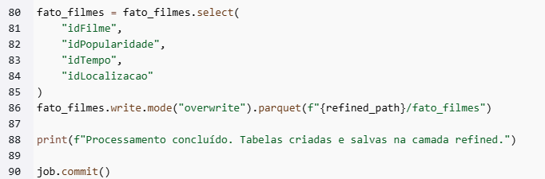

- Por fim, temos a consolidação final das colunas da tabela fato, assim como a finalização do job.

### **3.2. Resultado do processamento**

Após o processamento do job, a camada Refined ficou da seguinte forma no datalake:

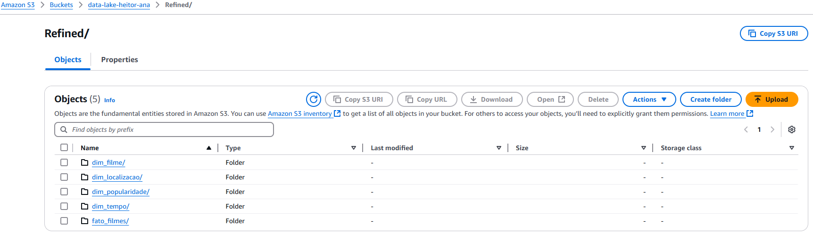

- Aqui podemos ver que não houve particionamento com a data atual, mas sim por cada tabela.

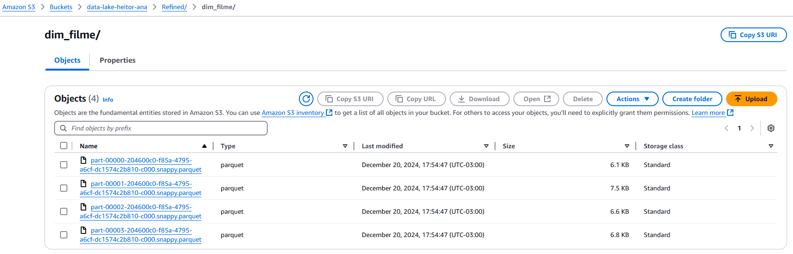

- Na imagem acima, é possível visualizar como os arquivos parquet foram gravados. 

### **4. Evidências no bucket**

Na imagem abaixo é possível visualizar como ficou o datalake após todos esses processamentos:

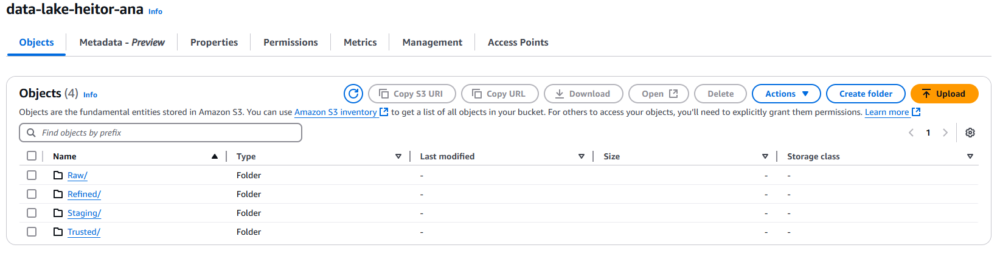

### **5. Crawlers**

Os crawlers são ferramentas automatizadas com o objetivo de explorar os dados armazenados, como explicado na sprint anterior. 

Neste desafio, foi decidido trabalhar na criação de dois crawlers, um para a camada staging e outra para a refined. Abaixo é possível visualizar os crawlers criados com sucesso. 

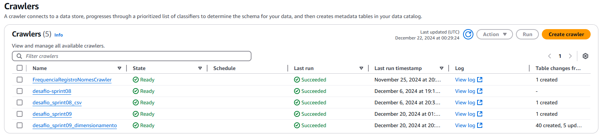

- Nessa sprint, os crawlers criados e executados foram:
    - `desafio_sprint09` e `desafio_sprint09_dimensionamento`. 

A criação desses crawlers é bem simples, basicamente bastou informar corretamente o caminho do S3 e executar. Podemos ver o resultado no Athena:

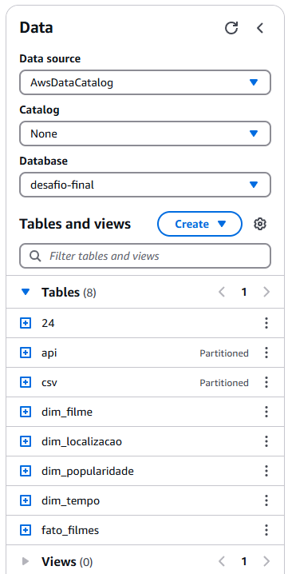

- A tabela `24` é a tabela unificada no primeiro Job. As tabelas `api` e `csv` são referentes à sprint anterior. 

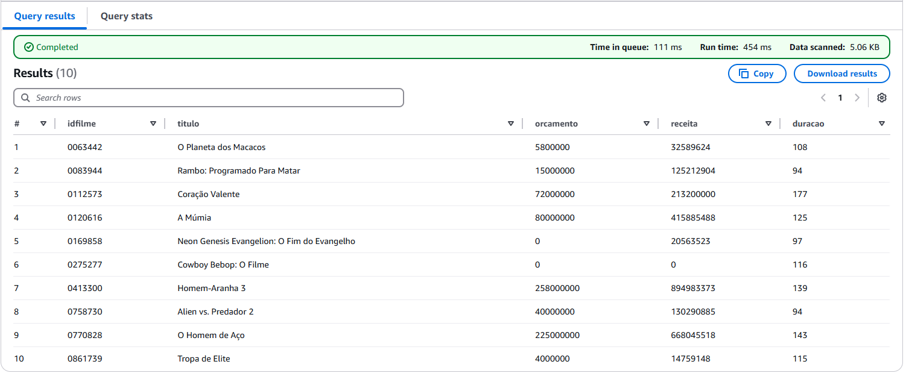

Na imagem acima podemos ver o resultado de uma query na tabela `dim_filme`, encerrando o desafio da Sprint 09. 

## **6. Definição de Tema - Atualização**

Durante todo o processo do desafio e agora com a modelagem dimensional concluída, foi possível ter novos insights sobre a análise a ser realizada. O desafio continuará abordando a perspectiva da relação entre orçamento e qualidade em filmes de ação, mas não contemplará apenas uma década. Com os dados coletados, foi observada a possibilidade de trabalhar com um recorte muito maior, fazendo com que surjam perguntas e comparações mais interessantes.

As perguntas motivadoras continuam as mesmas, com a diferença do recorte da data, que terá foco em trazer uma abordagem dos filmes de todas as épocas. Dessa forma, a ideia de questionar a utilização do surgimento de tecnologias como CGI caem, mas ao mesmo tempo outras surgem, como:

- Existe um padrão de correlação entre popularidade e avaliação de qualidade durante os anos?
- Como é possível notar a mudança dos valores de orçamento destinados aos filmes conforme a época? 
- Como podemos notar a relação do retorno do investimento realizado e a qualidade dos filmes? E como podemos comparar esses fatores de acordo com as décadas? 
- A época do lançamento (mês, ano, década) impacta a qualidade ou o sucesso desses filmes? Existe relação direta entre os períodos e os maiores orçamentos?

